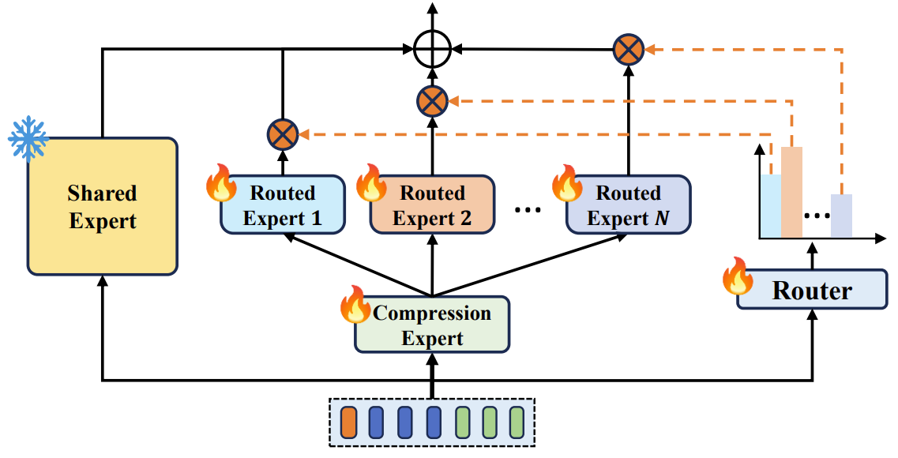
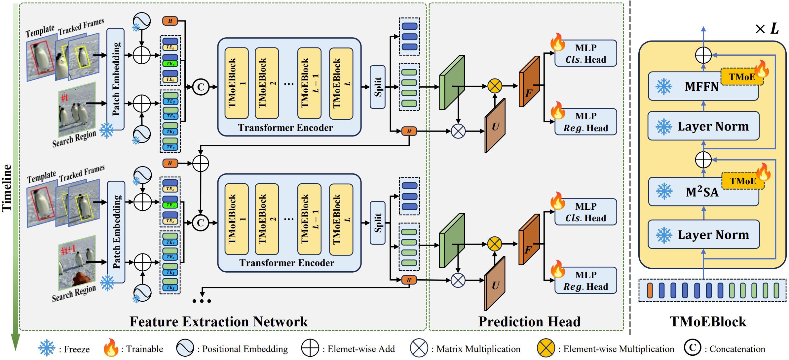

# [CVPR 2025] SPMTrack: Spatio-Temporal Parameter-Efficient Fine-Tuning with Mixture of Experts for Scalable Visual Tracking

Official implementation of [SPMTrack: Spatio-Temporal Parameter-Efficient Fine-Tuning with Mixture of Experts for Scalable Visual Tracking](https://arxiv.org/abs/2503.18338). (CVPR 2025)


### ⭐Introduction

Most current trackers adopt one-stream paradigm, using a single Vision Transformer for joint feature extraction and relation modeling of template and search region images. A single model may not effectively handle all kinds of relation modeling simultaneously. And there are also many works that design different strategies for different type of tokens (foreground/background, template/search region). That motivates us to design a tracker that can adaptively handle different relation modeling.

SPMTrack is based on mixture-of-experts tailored for visual tracking task (TMoE), combining the capability of multiple experts to handle diverse relation modeling more flexibly. We employ TMoE as a parameter-efficient fine-tuning method, substantially reducing trainable parameters, which enables us to train SPMTrack of varying scales efficiently and preserve the generalization ability of pretrained models to achieve superior performance. 



At the same time, we extend relation modeling from image pairs to spatio-temporal context, further improving tracking accuracy with minimal increase in model parameters, and demonstrates that TMoE can also achieve significant performance improvement in spatio-temporal context modeling.



### ⭐Strong Performance

You can download the model weights and raw_result from [Google Drive](https://drive.google.com/drive/folders/1bPnVG7ZcTNHgRgVf7Jydp9zFwdQf-3bV?usp=sharing).

**TODO:** - [ ] Upload Trained Model Weights.

| Tracker        | #Params     | #Trainable Params | LaSOT (AUC / Norm P/ P) | GOT-10K (AO / SR0.5 / SR0.75) | TrackingNet (AUC / Norm P/ P) |
| -------------- | ----------- | ----------------- | ----------------------- | ----------------------------- | ----------------------------- |
| **SPMTrack-B** | **115.3M**  | **29.2**          | **74.9/84.0/81.7**      | **76.5/85.9/76.3**            | **86.1/90.2/85.6**            |
| **SPMTrack-L** | **379.6M**  | **75.9**          | **76.8/85.9/84.0**      | **80.0/89.4/79.9**            | **86.9/91.0/87.2**            |
| **SPMTrack-G** | **1339.5M** | **204.0**         | **77.4/86.6/85.0**      | **81.0/89.2/82.3**            | **87.3/91.4/88.1**            |

Our code will automatically calculate flops during operation. Using different numbers of reference frames will result in different amounts of computation. You can adjust it as you like.


## Quick Start

### Data Preparation

- Put the tracking datasets in `./data`. It should look like this:

```
${PROJECT_ROOT}
 -- data
     -- lasot
         |-- airplane
         |-- basketball
         |-- bear
         ...
     -- got10k
         |-- test
         |-- train
         |-- val
     -- coco
         |-- annotations
         |-- images
     -- trackingnet
         |-- TRAIN_0
         |-- TRAIN_1
         ...
         |-- TRAIN_11
         |-- TEST
```

- Edit the dataset path in  `./consts.yaml`

  ```yaml
  LaSOT_PATH: '/path/to/lasot'
  GOT10k_PATH: '/path/to/got10k'
  TrackingNet_PATH: '/path/to/trackingnet'
  COCO_2017_PATH: '/path/to/coco2017'
  ```

  

### Install the environment

Our implementation is based on PyTorch 2.3.1+CUDA12. Use the following command to install the runtime environment:

```
conda env create -f SPMTrack_env_cuda12.yaml
```


### Training

Note: Our code performs evaluation automatically when model training is complete.

- ***Model weight*** is saved in ```/path/to/output/run_id/checkpoint/epoch_{last}/model.bin```.

- ***Performance metrics*** can be found on terminal output and wandb dashboard.

- ***Tracking results*** are saved in ```/path/to/output/run_id/eval/epoch_{last}/```.

For convenience, you can just run `bash train.sh`  to start training SPMTrack-B.

##### Using boot.sh helper script
```shell
# Train and evaluate SPMTrack-B model on all GPUs
./boot.sh SPMTrack dinov2 --output_dir /path/to/output
# Train and evaluate SPMTrack-L model on all GPUs
./boot.sh SPMTrack dinov2 --output_dir /path/to/output --mixin large_378_warmup
# Train and evaluate SPMTrack-G model on all GPUs
./boot.sh SPMTrack dinov2 --output_dir /path/to/output --mixin giant_378
# Train and evaluate SPMTrack-B model following GOT-10k protocol on all GPUs
./boot.sh SPMTrack dinov2 --output_dir /path/to/output --mixin got10k
# Train and evaluate on specific GPUs
./boot.sh SPMTrack dinov2 --output_dir /path/to/output --device_ids 0,1,2,3
# Train and evaluate on multiple nodes
./boot.sh SPMTrack dinov2 --output_dir /path/to/output --nnodes $num_nodes --node_rank $node_rank --master_address $master_node_ip --date 2025.06.09-12.00.00-123456
```
You can set the default settings, e.g. `output_dir`, in ```boot.sh```.


### Evaluation

Our code performs evaluation automatically when model training is complete. You can run evaluation only with the following command:
```shell
# evaluation only, on all datasets, defined in config/_dataset/test.yaml
./boot.sh SPMTrack dinov2 --output_dir /path/to/output --mixin evaluation --weight_path /path/to/weight.bin
```
The evaluated datasets are defined in ```config/_dataset/test.yaml```.

#### TrackingNet evaluation
Once the full evaluation is done, result files are saved in ```/path/to/output/run_id/eval/epoch_{last}/TrackingNet-test.zip```.

Submit this file to the [TrackingNet evaluation server](https://tracking-net.org/) to get the result of TrackingNet test split.

### Train and evaluate with GOT-10k dataset
```shell
# Train and evaluate SPMTrack-B model following GOT-10k protocol on all GPUs
./boot.sh SPMTrack dinov2 --output_dir /path/to/output --mixin got10k
```
Submit ```/path/to/output/run_id/eval/epoch_{last}/GOT10k-test.zip``` to the [GOT-10k evaluation server](http://got-10k.aitestunion.com/) to get the result of GOT-10k test split.

Evaluation only:
```shell
# evaluation only, on GOT-10k dataset
./boot.sh SPMTrack dinov2 --output_dir /path/to/output --mixin got10k --mixin evaluation --weight_path /path/to/weight.bin
```

Note that, as defined in ```config/LoRAT/_mixin/got10k.yaml```, we evaluate GOT-10k dataset three times.


## Citing SPMTrack

```latex
@inproceedings{cai2025spmtrack,
    author    = {Cai, Wenrui and Liu, Qingjie and Wang, Yunhong},
    title     = {SPMTrack: Spatio-Temporal Parameter-Efficient Fine-Tuning with Mixture of Experts for Scalable Visual Tracking},
    booktitle = {Proceedings of the Computer Vision and Pattern Recognition Conference (CVPR)},
    month     = {June},
    year      = {2025},
    pages     = {16871-16881}
}
```


## Acknowledgement

Thanks to the following repo for providing us with a lot of convenience to implement our method.

- [LoRAT](https://github.com/LitingLin/LoRAT)


## Contact

If you have any questions, just create issues or email me. 😀